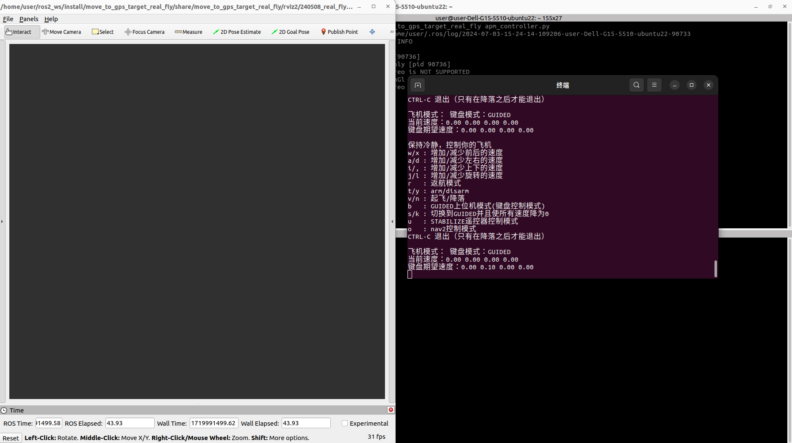
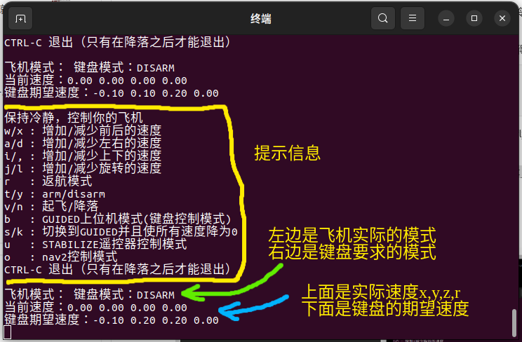
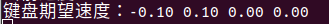

这边建议读完整个markdown文件再开始上手哈，主要是本人表述能力不太行，还请多多见谅
# 简介
## 一开始的设想目标
这是一个完成了一部分的ros2的软件，这个软件包一开始设想的最终效果是能从a定位码起飞，然后自行飞到指定gps点的b定位码上，然后在b定位码点自动降落，飞行的期间还要能通过多个指定gps点，并自动进行避障。

拆解一下大体是这么几个功能：
- 记载电脑控制无人机飞行
- 飞行避障
- gps点路径规划然后自动飞过去
- 定位码起降
## 当下的进度
- 记载电脑控制无人机飞行（已实现）
- 飞行避障（用ros2的nav2配合二维激光雷达来实现了，在实际测试中有效果，但是碰到玻璃障碍时效果差，很依赖激光雷达的效果）
- gps点路径规划然后自动飞过去（已经实现了gps点与tf的坐标变换，但这部分还有其他的工作）
- 定位码起降（已经实现了通过apriltag包来发布定位码与飞机的tf变换，这段代码可以在“关于无人机”中找到，这部分的功能目前还没有添加进本软件包）

# 软件环境与依赖
- ubuntu22
- ros2-humble
- nav2
- 思岚激光雷达的ros2驱动包sllidar_ros2
- dronekit-python
- apriltag的python包

# 如何使用
**确保你的环境都装好了，确保无人机开机了**
## 启动机载电脑的远程窗口
用来开发的电脑前往move_to_gps_target_real_fly/launch，然后运行下面的命令，下面的命令会要求输入密码，它会启动远程到机载电脑的ssh窗口

修改connect.sh里的用户名、ip和密码，是他们和你的机载电脑的一致
```
sudo chmod 777 connect.sh
bash connect.sh
```
## 启动机载电脑控制apm飞控的ros包

然后在新开的ssh窗口里运行下面的命令，它会启动move_to_gps_target_real_fly包，具体可以去看源代码

`ros2 launch move_to_gps_target_real_fly move_to_gps_target_real_fly.py`

### 要用键盘控制无人机飞行的话，按以下步骤操作：

先在用来开发的电脑上运行下面的命令

`ros2 launch move_to_gps_target_real_fly apm_controller.py`

这个命令会打开rviz2窗口和一个远程控制无人机的终端，如下图





#### 这个远程控制无人机的终端值得介绍一下：

飞机的模式在move_to_gps_target_real_fly/move_to_gps_target_real_fly/apm_controller_node.py写了，它和apm的模式是不一样的，具体来说，apm_controller_node.py规定了下面几种模式：

1. GUIDED 对应键位是b

    这个模式是apm自带的模式，中文名是叫“引导模式”，这个模式下apm飞控会执行机载电脑、地面站的指令，刚打开远程控制终端的时候得先切换到这个模式才能执行其他命令

    GUIDED时，机载电脑或者地面站必须始终向apm飞控发送指令和心跳信息，一旦心跳消失，apm飞控会自动切换从RTL模式，所以键盘上切换到这个模式时，机载电脑会始终向ros2的apm控制节点发送高权限的键盘控制命令，同时，ros2的apm控制节点会始终向apm飞控发送运动指令

2. DISARM 对应键位是y

    这个模式在apm只是一个指令，它的功能就是上锁，要在远程终端使用它得先切换到GUIDED模式，并且得在停稳的时候才能使用

3. ARM 对应键位是t

    这个模式在apm只是一个指令，它的功能就是解锁，要在远程终端使用它得先切换到GUIDED模式，并且得在停稳的时候才能使用

4. TAKEOFF 对应键位是v

    这个模式在apm是一系列指令，它的功能是让无人机在解锁之后起飞到指定高度TAKE_OFF_ALTITUDE，要在远程终端使用它得先切换到GUIDED模式，并且在解锁且未起飞时才能使用

5. RTL 对应键位是r

    这个模式是apm自带的模式，中文名是叫“返航模式”，效果是使用了之后会飞到返航高度（返航高度得通过apm地面站设置），然后飞回起飞点
6. STABILIZE 对应键位是u

    这个模式是apm自带的模式，中文名是叫“自稳模式”，效果是使用了之后apm飞控会根据遥控器操作自行稳定飞行，简单来说就是可以用遥控器飞

    切换过来的时候会直接执行遥控器的操作，假如此时遥控器油门为0,那apm飞控就会直接执行0油门时的动作，**不会有反应时间**
    
7. LAND 对应键位是n

    这个模式是apm自带的模式，中文名是叫“降落模式”，效果是使用了之后apm飞控会以安全的速度垂直下降，撞击到地面时会自动上锁


很值的说明的是：apm自带的模式可以在任何情况下切换进入，**任何情况**

比方说，飞机在起飞到指定高度时被风吹走了，可以直接按下s，按键s和k会切换到GUIDED并且设置各个方向速度为0

再比方说，飞机在GUIDED模式下因为种种原因不能很好的执行命令并且快撞了，这个时候可以按u切换到遥控器飞行，也可以按n让飞机自行降落

再比方说，飞机在LAND模式下降落出了问题，可以直接按u，让遥控器接管飞行

远程控制无人机的终端上还能再多一种模式

1. KEYBOARD_LOCK 对应键位是o
    
    键盘的其他模式都是向apm的ros2的apmControllernNameSpace+'/target_mode'话题发送数据，只有这个命令不同

    它的功能是不再向apm的ros2的控制节点发送速度控制指令

    此时，如果nav2启动了并且有规划，那么nav2发送的运动指令会被执行

**很值得说明的是：远程控制无人机的终端在启动后会在任何情况下捕获键盘事件，即使它被最小化了，KEYBOARD_LOCK模式下键盘并不会停止接收键盘事件，它只是不发送，并且要是键盘上按到模式转换的按键，键盘会照做的，所以比较好的办法是把这个这个终端关了**

终端显示的速度分别表示：前后，左右，上下，顺逆时针旋转（大于0逆时针，小于0顺时针）

#### 远程控制无人机的终端的操作说明：

1. 首先按下b进入引导模式，然后按下t进行无人机的解锁
2. 按下v，无人机会起飞到指定高度，到达指定高度后会自动进入引导模式并且各个方向速度为0
3. 无人机起飞的任何时候都可以按下s或者k，这两个按键会要求无人机进入引导模式并且各个方向速度为0
4. 无人机起飞之后，键盘上按一次w会要求无人机在前后的方向上增加一个LINEAR_STEP_SIZE大小的数值，单位是m/s，LINEAR_STEP_SIZE在move_to_gps_target_real_fly/launch/apm_keyborad_controller.py中被规定了，现在是0.1，按一次x则会在在前后的方向上减小一个LINEAR_STEP_SIZE大小的数值

    比分说，按3次w，键盘要求的前后速度就会增加3个LINEAR_STEP_SIZE

    

    按4次x，键盘要求的前后速度就会减少4个LINEAR_STEP_SIZE

    

    按一下a，左右方向增加一个LINEAR_STEP_SIZE，按一下d，左右方向减少一个LINEAR_STEP_SIZE

    按一下i，上下方向增加一个LINEAR_STEP_SIZE，按一下“,”，上下方向减少一个LINEAR_STEP_SIZE

    按一下j，旋转增加一个ANG_VEL_STEP_SIZE，按一下l，旋转减少一个ANG_VEL_STEP_SIZE

5. 要降落的话，可以用键盘控制无人机以安全速度下降，到达地面之后按下y上锁，但是比较推荐的降落方式是按下n自动降落

### 要用rviz2引导无人机飞行的话，按以下步骤操作：

1. 首先按“键盘控制无人机飞行”的顺序让无人机起飞
2. 按一下s，然后在rviz2上发送目标点指令
3. 键盘上按一下o，不让readme_image/键盘再发送指令
4. 要用键盘接管控制的话，键盘按一下s或者k
4. 要降落的话，先让键盘接管，然后按上一节降落

### 要用gps点引导飞行的话，按以下步骤操作：

1. 首先按“键盘控制无人机飞行”的顺序让无人机起飞
2. 按一下s，然后向apmControllernNameSpace+'/target_gps_location'发送坐标数据，具体可以参考move_to_gps_target_real_fly/move_to_gps_target_real_fly/target_gps_publisher_test_node.py和move_to_gps_target_real_fly/move_to_gps_target_real_fly/apm_tf_node.py，此时机载电脑会自动导航
3. 键盘上按一下o，不让键盘再发送指令
4. 要用键盘接管控制的话，键盘按一下s或者k
4. 要降落的话，先让键盘接管，然后按上一节降落

### 要分析ros的日志数据的话，按以下步骤操作：

1. 用rviz2：

    前往ros日志数据所在的文件夹`cd ~/ros2_recorder`,然后用ros2的bag包回放指定时间的日志信息，下面命令的“xxx”替换成实际的文件夹`ros2 bag play xxx`

2. 用foxglove studio：

    启动foxglove studio，然后打开要播放的日志的.db3文件
# 目录介绍
1. behavior_tree

    behavior_tree里面放有被修改过的nav2行为树文件，这个文件会被nav2调用

2. launch

    ros2的节点启动文件所在的文件夹

3. maps

    nav2需要用到的空地图所在的文件夹

4. move_to_gps_target_real_fly

    ros2的节点文件所在文件夹

5. params

    nav2的配置文件的文件夹

6. resource

    ros2创建包时自带的文件夹

7. rviz2

    存放修改好的rviz2布局的文件夹

8. test

    ros2创建包时自带的文件夹

9. readme_image

    readme的图片

# 代码讲解

关于代码的细节，还请查看源代码
## launch
### apm_controller.py
apm_controller.py是用来在远程控制的设备上使用的，运行之后会自动打开rviz2和一个控制无人机的窗口,要启动可以使用以下命令：

`ros2 launch move_to_gps_target_real_fly apm_controller.py`

### apm_keyborad_controller.py
apm_keyborad_controller.py会启动一个控制无人机飞行的窗口，这是一个ros2节点，而不是launch文件，但是它和本软件包的其他节点又有些区别，它主要是跑在远程控制的设备上的，所以就放在此处了
### connect.sh
connect.sh是一个linux脚本，用来在远程控制的设备上，便捷启动远程到运行此软件包的机载电脑的窗口
使用`bash connect.sh`运行之后会打开几个远程到香橙派的窗口
### move_to_gps_target_real_fly.py
move_to_gps_target_real_fly.py是启动无人机控制程序的主要launch文件

要启动可以使用以下命令：

`ros2 launch move_to_gps_target_real_fly move_to_gps_target_real_fly.py`
### ros2_recorder.sh
ros2_recorder.sh是用来录制无人机飞行过程中的ros数据的linux脚本，它会被move_to_gps_target_real_fly.py调用

它会把录制的数据保存在~/ros2_recorder下
### sllidar_a2m8_launch.py
sllidar_a2m8_launch.py是用来启动激光雷达并发布相关ros数据的，它会被move_to_gps_target_real_fly.py调用
## ros2节点
### apm_controller_node.py
apm_controller_node.py是本机和apm飞控通信的节点，它会通过dronekit连接到apm，然后再发送ros2的节点话题

订阅的话题（Subscriptions）

    apmControllernNameSpace + '/target_mode'（std_msgs/String）：
        用于接收目标飞行模式的消息。
    apmControllernNameSpace + '/target_cmd_vel'（geometry_msgs/Twist）：
        用于接收目标速度的消息。
    apmControllernNameSpace + '/high_permission_target_cmd_vel'（geometry_msgs/Twist）：
        用于接收高权限目标速度的消息。
        有高权限目标速度的时候，普通权限的命令会不管
        高权限命令的话题现在只有apm_keyborad_controller.py会发
    /clock（rosgraph_msgs/Clock）：
        用于接收仿真时钟消息（如果存在/clock话题）。

发布的话题（Publications）

    apmControllernNameSpace + '/current_velocity'（geometry_msgs/Twist）：
        发布当前速度信息。
    apmControllernNameSpace + '/current_mode_state'（std_msgs/String）：
        发布当前飞行模式状态信息（如armed或disarmed）。
    apmControllernNameSpace + '/current_mode'（std_msgs/String）：
        发布当前控制模式。值得说明的是这个状态并不完全是apm规定的无人机状态，具体请参考源代码
    apmControllernNameSpace + '/current_attitude'（std_msgs/String）：
        发布当前姿态信息（Roll, Pitch, Yaw）。
    apmControllernNameSpace + '/current_GPS'（sensor_msgs/NavSatFix）：
        发布当前GPS信息。
    apmControllernNameSpace + '/current_battery'（sensor_msgs/BatteryState）：
        发布当前电池状态。这个话题目前只能发布假信息，待完善
    apmControllernNameSpace + '/current_local_location'（geometry_msgs/PoseStamped）：
        发布apm飞控的ekf融合的gps+imu+其他七七八八传感器数据得到的定位信息。
    apmControllernNameSpace + '/home_gps_location'（sensor_msgs/NavSatFix）：
        发布home点GPS位置。
apmControllernNameSpace是一个变量，只要每个节点的apmControllernNameSpace变量值统一即可
### apm_tf_node.py
apm_tf_node.py会订阅apm_controller_node.py发布的ros话题，然后发布无人机的tf坐标变换
同时，它还会订阅目标gps点坐标，然后转换成tf坐标变化，并发布目标点到/goal_pose，使得nav2进行导航

订阅的话题（Subscriptions）

    ${apmControllernNameSpace}/current_local_location (geometry_msgs/PoseStamped)
        接收无人机的apm飞控的定位信息。

    ${apmControllernNameSpace}/current_attitude (std_msgs/String)
        接收无人机的当前姿态信息。

    /clock (rosgraph_msgs/Clock)
        接收仿真时钟信息（如果存在 /clock 话题）。

    ${apmControllernNameSpace}/target_gps_location (sensor_msgs/NavSatFix)
        接收目标 GPS 位置。

    ${apmControllernNameSpace}/home_gps_location (sensor_msgs/NavSatFix)
        接收 home 点 GPS 位置。

发布的话题（Publications）

    tf (tf2_msgs/TFMessage)
        发布 TF 变换消息，包括无人机的本地位置和姿态，以及目标位置。

    /goal_pose (geometry_msgs/PoseStamped)
        发布目标位置的姿态信息。
### my_velocity_controller.py
my_velocity_controller.py会检查飞机正前方一片区域的雷达数据，并根据距离对飞机最高速度做出适当限制

很值得说明的是，/cmd_vel是nav2发布的速度命令的话题，${apmControllernNameSpace}/target_cmd_vel才是apm_controller_node会执行的关于速度控制的话题

订阅的话题（Subscriptions）

    /cmd_vel (geometry_msgs/Twist)
        接收目标速度指令。

    ${apmControllernNameSpace}/current_velocity (geometry_msgs/Twist)
        接收当前速度信息。

    /scan (sensor_msgs/LaserScan)
        接收激光雷达扫描数据。

发布的话题（Publications）

    ${apmControllernNameSpace}/target_cmd_vel (geometry_msgs/Twist)
        发布调整后的目标速度指令。

服务（Services）

    /controller_server/set_parameters (rcl_interfaces/srv/SetParameters)
        设置控制器参数。

    /controller_server/get_parameters (rcl_interfaces/srv/GetParameters)
        获取控制器参数。
### regularly_clear_costmap_after_starting_nav2_node.py
regularly_clear_costmap_after_starting_nav2_node.py会定时清除nav2的代价地图，以实现动态检测障碍物的效果，不过这样的弊端是会使得nav2在使用的时候没有记忆
此节点不订阅和发布任何话题

服务（Services）

    清理局部代价地图：定期调用 self.nav2.clearLocalCostmap。
    清理全局代价地图：定期调用 self.nav2.clearGlobalCostmap。
### target_gps_publisher_test_node.py
这是一个用来测试的节点，它会发布gps数据到 apmControllernNameSpace+'/target_gps_location'话题，apm_tf_node.py收到话题后会进行导航

发布话题：

    ${apmControllernNameSpace}/target_gps_location (sensor_msgs/NavSatFix)
        发布目标 GPS 位置。